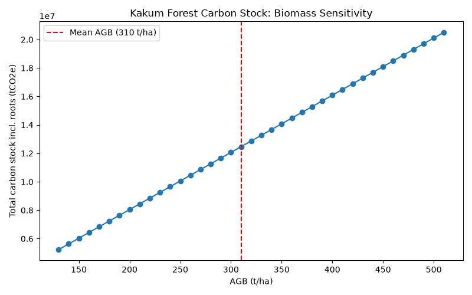
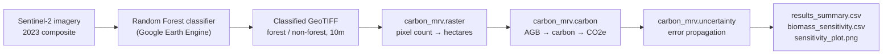

# Kakum Forest Carbon MRV

A satellite-based forest carbon Measurement, Reporting & Verification (MRV) prototype
for Kakum National Park, Ghana — structured to mirror the measurement logic of a
real Verra REDD+ (VM0048) project. Google Earth Engine handles the pixel
classification; a tested Python package handles area verification, carbon
accounting, and uncertainty analysis.

| Metric | Value |
|---|---|
| Forest area | **18,817 ha** (of 21,168 ha park) |
| Carbon stock, above-ground | **≈10.0M tCO₂e** |
| Carbon stock, incl. roots | **≈12.47M tCO₂e** |
| Combined uncertainty | **≈61.5%** |
| Conservative (lower-bound) estimate | **≈4.80M tCO₂e** |
| Classification accuracy | **95.5%** |
| Tests | **10/10 passing** |



## How it works



1. **Classification (Google Earth Engine)** — a Random Forest classifier trained on
   2023 Sentinel-2 imagery separates forest from non-forest across the official WDPA
   "Kakum" boundary (95.5% held-out accuracy). See [`gee/`](gee/). A simple NDVI
   threshold doesn't work here — forest and surrounding farmland differ by only
   ~0.04 in NDVI in this humid landscape, so the classifier instead uses
   shortwave-infrared bands to tell them apart.
2. **Export** — the classified raster is exported as a GeoTIFF (EPSG:32630, 10 m
   pixels) into [`data/`](data/).
3. **Analysis (this Python package)** — [`run.py`](run.py) reads the GeoTIFF, computes
   forest area from the pixel count, applies IPCC Tier 1 biomass defaults to get
   carbon stock, and propagates uncertainty (classification error and biomass-default
   range, combined in quadrature) through to a conservative lower-bound estimate.

## Why the uncertainty matters

The 95.5%-accurate classifier contributes only ~4.5% of the total error. The other
~61% comes from the IPCC Tier 1 biomass default (a continent-wide average with a
130–510 t/ha range) — not from the map. That diagnosis is what motivates the planned
next step: swapping in site-specific biomass from NASA's GEDI spaceborne lidar,
which should narrow the range substantially. See [`ROADMAP.md`](ROADMAP.md) for the
full plan.

## Repo structure

```
README.md               Project overview (this file)
ROADMAP.md              Planned Tier 2 (GEDI biomass) upgrade
gee/                    Earth Engine classifier script
data/                   Input GeoTIFF (classified raster from GEE)
carbon_mrv/             Python package: area, carbon, and uncertainty calculations
  config.py             Loads and validates config.yaml
  raster.py             Forest area from the classified GeoTIFF (rasterio)
  carbon.py             Biomass -> carbon -> CO2e (pure functions)
  uncertainty.py        Area/biomass/combined uncertainty, conservative estimate
run.py                  Orchestrates the pipeline end to end
config.yaml             All science parameters (AGB, carbon fraction, ratios, etc.)
tests/                  Unit tests for carbon.py and uncertainty.py
outputs/                Generated: results_summary.csv, biomass_sensitivity.csv,
                        sensitivity_plot.png
```

## Running it

Requires Python 3.14+.

```bash
python -m venv .venv
.venv\Scripts\python.exe -m pip install -r requirements.txt   # Windows
# source .venv/bin/activate && pip install -r requirements.txt  # macOS/Linux

.venv\Scripts\python.exe run.py                                # Windows
```

Must be run from the repo root (`run.py` loads `config.yaml` via a relative path).
This writes `outputs/results_summary.csv`, `outputs/biomass_sensitivity.csv`, and
`outputs/sensitivity_plot.png`.

Run the tests:

```bash
.venv\Scripts\python.exe -m pytest tests/ -v
```

## Honest limitations

- This is a carbon **stock** at a single date, not an emissions estimate — an
  emissions figure needs a second image date to measure change over time.
- Biomass uses IPCC Tier 1 (continent-average) defaults, hence the wide uncertainty
  range; see "Why the uncertainty matters" above.
- This is a portfolio prototype, not a registered carbon credit. A real Verra VM0048
  project would substitute Verra's jurisdictional baseline for the classification
  step shown here.

## License

MIT — see [`LICENSE`](LICENSE).
