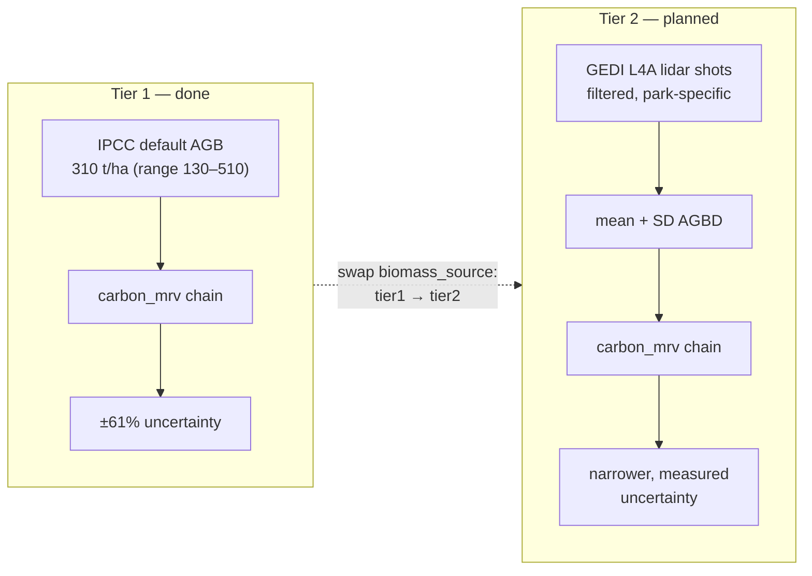

# Roadmap: Tier 2 biomass (GEDI)

**Status:** planned, not yet started. The Tier 1 pipeline (see [`README.md`](README.md))
is done and reproduces the known numbers end to end.

## Why this is next

The uncertainty analysis in the Tier 1 pipeline showed the error budget is lopsided:

| Source | Contribution to uncertainty |
|---|---|
| Classification (95.5% accurate) | ~4.5% |
| Biomass default (IPCC Tier 1, 130–510 t/ha range) | ~61% |

The classifier is already good. Almost all of the remaining uncertainty comes from
using a single continent-wide biomass default (310 t/ha) instead of a measurement
specific to this forest. That makes site-specific biomass the highest-value next
improvement — well ahead of any further tweak to the classifier.

## What GEDI gives you

GEDI is NASA's spaceborne lidar. Two products matter:

- **L4A — footprint above-ground biomass density (AGBD), in Mg/ha (= t/ha)**, per
  ~25 m footprint. Site-specific but sparse: scattered shots with gaps, not a
  wall-to-wall map. This is the genuine Tier 2 input.
- **L4B — gridded mean AGBD at 1 km.** Coarser, already modelled/gap-filled. Simpler
  if a single park-mean biomass is enough to replace the 310 default.

Both are in the Earth Engine catalog. Confirm the current asset IDs in the EE Data
Catalog before using (IDs get versioned) — as of last check they were roughly:

- L4A: `LARSE/GEDI/GEDI04_A_002_MONTHLY` (band `agbd`; quality bands too)
- L4B: `LARSE/GEDI/GEDI04_B_002`

## How it slots into the existing carbon calc

1. Load GEDI L4A over the park boundary.
2. Filter to good shots: keep `l4_quality_flag == 1` and `degrade_flag == 0` (drop
   low-quality / degraded-orbit footprints). This step matters — unfiltered GEDI is
   noisy.
3. Reduce the surviving `agbd` values to a **mean (and standard deviation)** inside
   the forest area of the park. That mean AGBD replaces the 310 t/ha default.
4. Feed that measured AGBD through the *same* chain already built in `carbon_mrv`:
   AGBD → ×(1 + root:shoot) → ×0.47 → ×44/12 → × forest hectares.
5. For uncertainty, swap the ±61% Tier 1 biomass range for GEDI's own spread (e.g.
   standard error of the mean AGBD, or the footprint SD). This is what *narrows* the
   error bar — the whole point of the upgrade.

## Staying honest

- The GEDI mean may come back **higher or lower than 310** — the headline carbon
  number can move in either direction. That's expected; it's a finding, not a bug.
- GEDI has its own uncertainty, so Tier 2 gives a **narrower but still real** range,
  not a precise point. Narrower and measured beats wide and defaulted.
- GEDI coverage over one small park can be thin. If shot count is low, note it as a
  limitation, or fall back to L4B (1 km gridded) for a simpler park-mean route.

## Planned changes

- Add a `gedi_biomass.js` GEE snippet (or a Python `ee` call) that exports the
  filtered mean/SD AGBD for the park.
- Extend `config.yaml` with a `biomass_source: tier1 | tier2` switch so both
  versions run from the same code and can be compared side by side.
